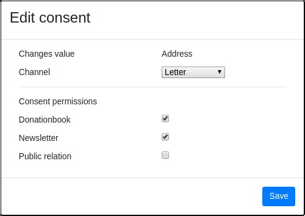

===============================
Contact edit
===============================

When you edit a contact, you might have to enter how this change has been noticed and what consents are allowed for this information.

This happens whenever you change a value which, according to the GDPR, needs a purpose to be processed. 

You also have the option of displaying the history for a contact and tracking individual data, by clicking the button in the upper right corner
of the contact edit window.
Here you can also adjust the purpose without having to enter new data, keep in mind that this action is also logged.

.. figure:: images/consent_view.png
      :scale: 50%
