=================
Process Donations
=================

We assume that the ledger has already been set up as described in :ref:`create-a-ledger`.

Configure the Projects
======================

The setup of a chart of accounts is described in :ref:`configure-chart-of-accounts`.
For donation accounting you could for example create account 0100 for 'General Donations',
and account 0200 for 'Project Specific Donations'.

Cost Centres can be configured for each specific project: see :ref:`configure-cost-centres`.
For donation accounting you could for example use cost centre 1000 for 'General Donations',
and create cost centre 102000 for 'Project Workers', and cost centre 103000 for 'Project New Vehicle 2019'.

Furthermore you need to set up motivations: see :ref:`configure-motivations`.
You need a motivation group, eg. 'DONATIONS', and for each project you need a matching motivation detail.
That means you could create DONATIONS/UNSPECIFIED, which points to account 0100 and cost centre 1000.
And DONATIONS/WORKERS would point to account 0200 and cost centre 102000.

At the moment, OpenPetra only supports the assignment of donations to projects. There is already the technical
preparation of OpenPetra to assign donations to individual workers, but we have not yet implemented this in the web browser client.

Manual entry of Donations
=========================

First we want to explain how to create a donation batch manually, and then create transactions for each donor,
with the option to split a donation across multiple projects.

You have to make a decision, depending on your amounts of donation, whether you want to have one donation batch per day or per month.
For smaller charities (less than 200 donations per month) we recommend to create all donations of a month in one donation batch.
There is a date for each donation anyway that tells us when the donation has arrived, and this date is also printed on the receipt.
The Batch Booking Date should be in this case on the last day of the month, in which the donations have arrived.

This is where you get to the list of donation batches: 'Finance'/'Donations'/'Donation Entry'/'Donation Batches'.
There you click the button 'Add'.

This is how you create a new donation batch:

.. _figure-gift_new_batch:

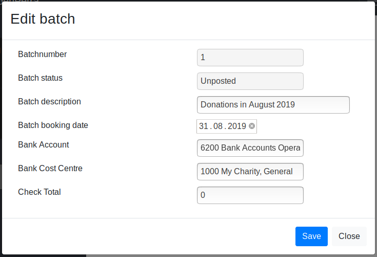

   Create a new donation batch

The Bank Account is the account which receives the bank transactions.
For double entry accounting it is important, that we post the incoming donation there.
When specifying each donation, we define for which purpose the money was given,
and which account and cost centre it should posted against, specified by the motivations.

Now you have the empty donation batch:

.. _figure-gift_empty_batch:

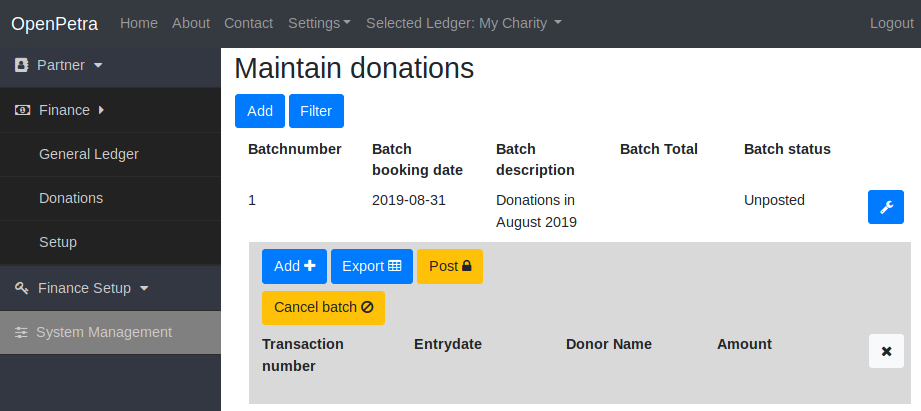

   Empty Donation batch

Now click the button 'Add', to enter individual donations.

The Entry date should be the date, at which the donation arrived at our bank account.
This date will appear also on the donation receipt.

.. _figure-gift_new_gift:

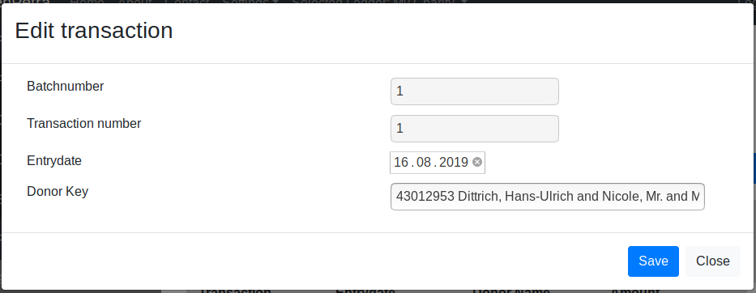

   New donation

First you must select the donor, and then click the button 'Save'.

Only then the button appears, that allows you to add details of the donation.

.. _figure-gift_new_gift2:

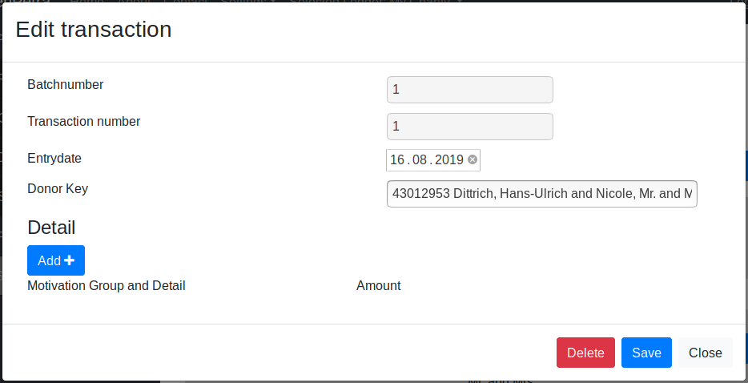

   Saved new donation, ready for details to be added

Now you can enter the details of the donation. Each donation has one or more details.
This means, that a donor can tell us before hand, or in the purpose description on the bank statement,
that eg. 20 Euro should be for the project 'General' and 10 Euro for Project 'Sponsorship'.

.. _figure-gift_new_detail:

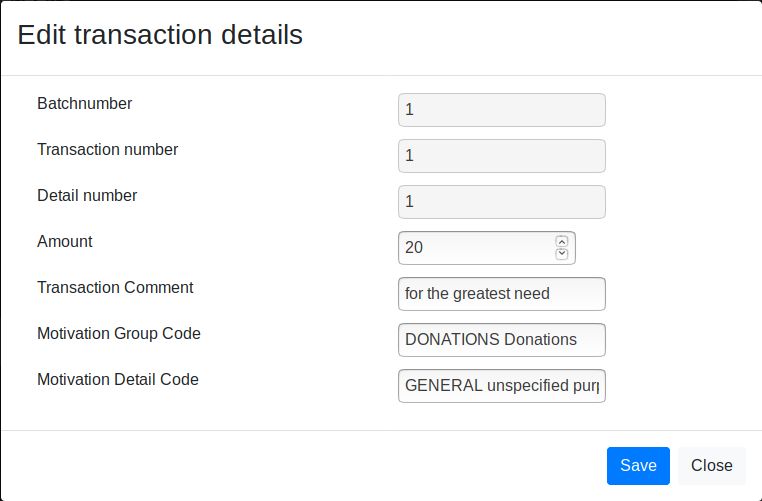

   Add new donation detail

After adding the donation details, this is how the donation looks like:

.. _figure-gift_details:

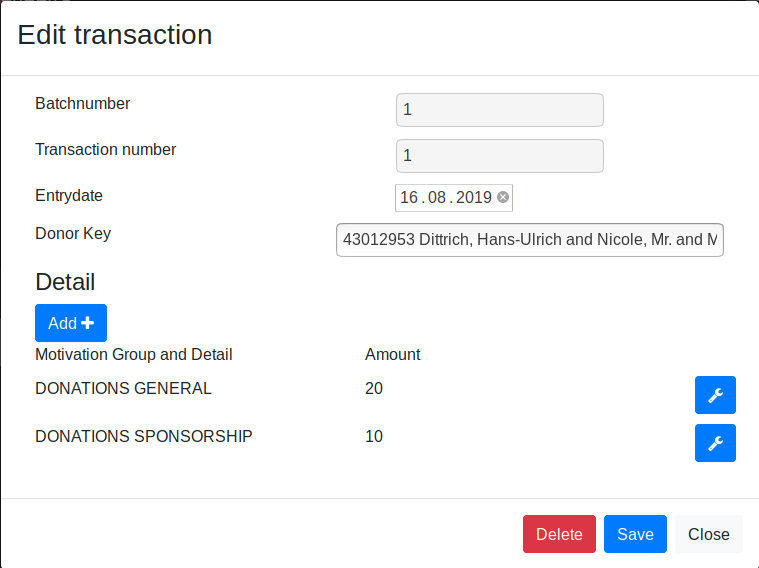

   Donation with Details

Now click the button 'Save', and you get back to the view of the Donation Batch.

After having entered all donations of the batch, the next step is to post the batch, which is described further down in this tutorial.

Process Donations semi-automatically from bank statement
========================================================

It is advisable to not enter each donation manually.

Your bank probably offers to download the bank statement as a CSV or CAMT file.

At the moment OpenPetra only supports processing bank statements as CSV files,
but the support for CAMT is basically finished, and can be activated if needed.

At the first run you need to specify some settings, because each bank has a different format for their CSV Fi.e.
Just click on the button 'Preset'.

.. _figure-bankimport_settings:

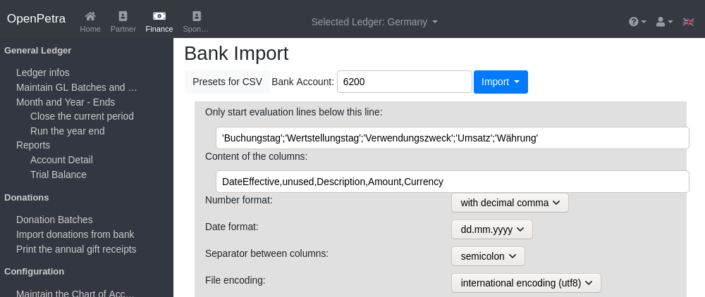

   Settings for bank import

The bank account is that account which receives all the donations, and the bank statement is about this account.

Only start evaluation lines below this line: This describes the content of the line, that is above the actual transactions.
So this is usually the line with the captions of the columns.

Furthermore you need to specify the order and the content of the columns.

* DateEffective: The date when the donation arrived on the bank account of the charity.
* unused: for columns that we want to ignore.
* Description: for the text that describes the donations. It can contain the name of the donor, perhaps even with the address, and the purpose of the donation.
* Amount: The amount of the donation.
* Currency: The currency of the donation. The currency should match with the base currency of the ledger or the currency of the bank account.

You can choose the number format (decimal point or decimal comma).
You can choose the format of the date: either 'dd.mm.yyyy' (Day.Month.Year), or 'mm.dd.yyyy (Month.Day.Year).

The separator between the values is either Comma or Semicolon, but could also be a tab character, depending on your bank.

The encoding of the file can be Latin-1, or hopefully UTF-8 which should be the standard nowadays.
You see that the encoding does not match if special characters like Umlaut are not displayed correctly. In that case, just try the other encoding.

Then click the button 'Save preset', and then click on 'Close' to hide the settings.

Now click the button 'Import', and pick the current bank statement as CSV file from your local computer.
OpenPetra will automatically recognise the month that should be imported, and transactions from the end of the previous month and from the start of the next month will be ignored.

This is how an example file can look like: (you can download it here: https://github.com/openpetra/openpetra/blob/master/csharp/ICT/Testing/lib/MFinance/server/BankImport/BankStatement2.csv)
::

   "Kontoumsätze Geschäfts- und Vereinskonto"

   "Kontoinhaber:";"Mein Verein e.V."
   "Kundennummer:";"1234567"

   "Umsätze ab";"Enddatum";"Kontonummer";"Saldo";"Währung"
   "01.07.2019";"31.07.2019";"1234567";"1.234,56";"EUR"
   "Weitere gewählte Suchoptionen:";"keine"

   "Buchungstag";"Wertstellungstag";"Verwendungszweck";"Umsatz";"Währung"
   "31.07.2019";"31.07.2019";"Heinrich Arndt SEPA-ÜBERWEISUNG SVWZ+ RINP Dauerauftrag Grundpatenschaft mein Patenkind";"30,00";"EUR";""
   "31.07.2019";"31.07.2019";"Werner Bastian SEPA-ÜBERWEISUNG SVWZ+ RINP Daue rauftrag Patenschaft";"30,00";"EUR";""
   "30.07.2019";"30.07.2019";"Arno Grosse SEPA-ÜBERWEISUNG SVWZ+ RINP Dauerauftrag S pende EREF+ 000000000000000 00002";"10,00";"EUR";""
   "* noch nicht ausgeführte Umsätze"

You have the choice to set the 'Status', whether you want to see all transactions, or only matched donations, etc.
Then click the button 'Display'.

In the example, that would look like this:

.. _figure-bankimport_all:

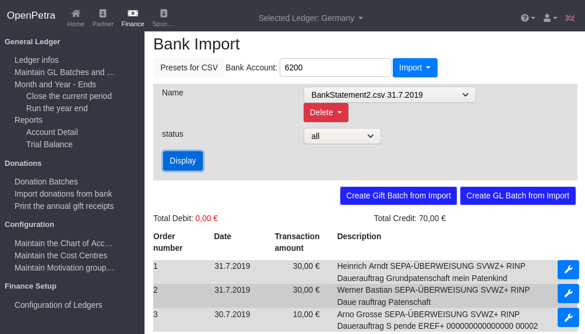

   View of the bank transactions

You can edit a transaction, and assign whether this transaction should be processed as a donation.
You assign the donor, and the purpose of the donation.

.. _figure-bankimport_donation:

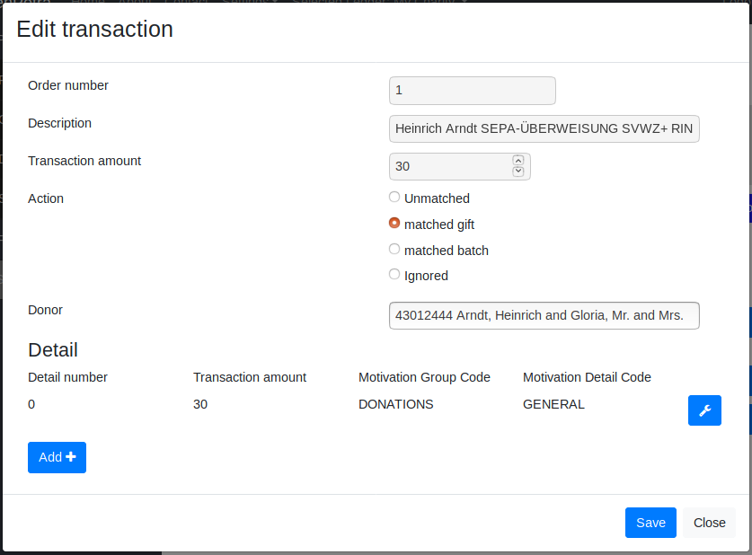

   Mark as donation

In the next month the donation will be automatically matched again, with the right donor and the right purpose,
if the amount and the description stays the same.

After all donations have been assigned properly, you click in the main view the button 'Create Gift Batch from Import'.

Now you can continue to process the donation batch as usual, which means to post it. This is described further below.

.. _figure-bankimport_posting:

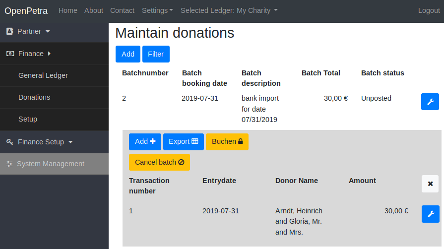

   Our imported donation batch is ready to be posted

Post a Donation Batch
=====================

Navigate to 'Finance'/'Donations'/'Donation Entry' to get to the 'Donation Batches'.

.. _figure-gift_post_batch:

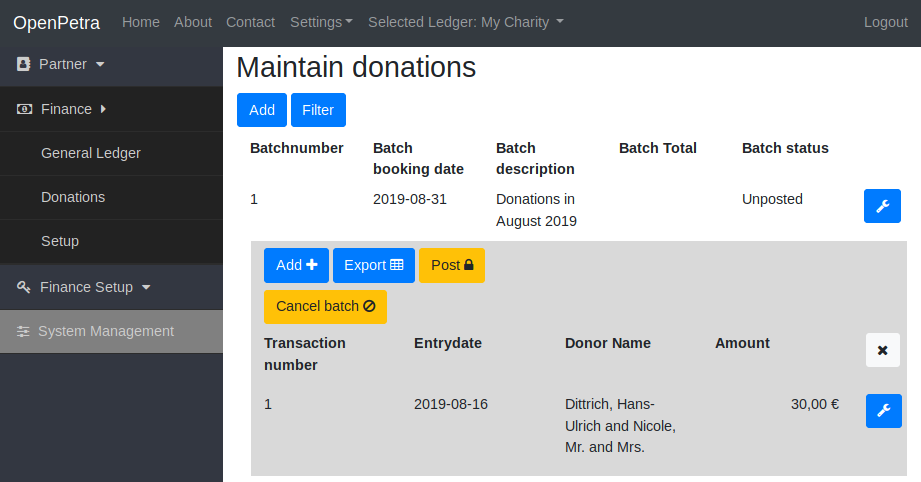

   A Donation Batch is ready to be posted.

There you first select the donation batch that you want to post, and then click the button 'Post'.

You should see message about the succesful posting of the batch.

Now the batch will not be visible in the list view anymore, if the list only shows unposted donation batches.

You can change that by clicking the button 'Filter':

.. _figure-gift_find_batch:

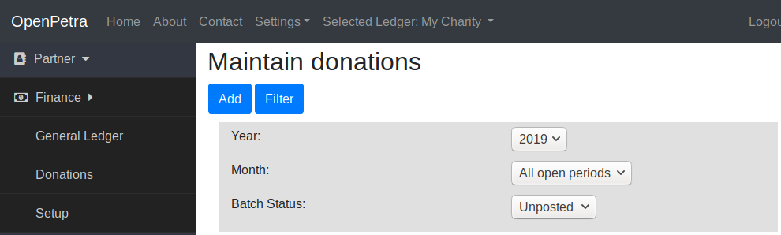

   You can modify the filter for the view of the donation batches.

You can switch the status for the batch from Unposted to Posted or All, and even Canceled, to display the cancelled batches.

You can also filter by period.

Report: Income by Project
=========================

How can you find out, how much money has been donated towards each project?

This area can certainly still use some improvement, but at the moment it is possible,
to use the Account Detail report to get that kind of information.

Navigate to 'Finance'/'General Ledger'/'Reports' and find there the 'Account Detail' report.

Now you need to set the parameters for the report:

.. _figure-report_account_detail_parameters:

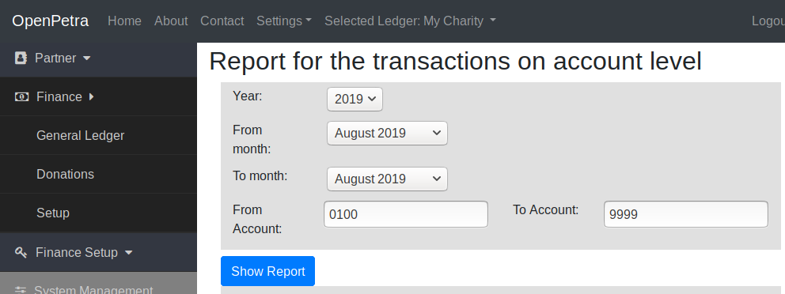

   Configure the parameters for the Report

You can select the financial year, and the period considered for the report.

You also select the accounts that should be covered by this report.
At the moment, all cost centres appear on this report, and there is no option to select specific cost centres.

Then click the button 'Show Report'.

The result will be presented:

.. _figure-report_account_detail_result:

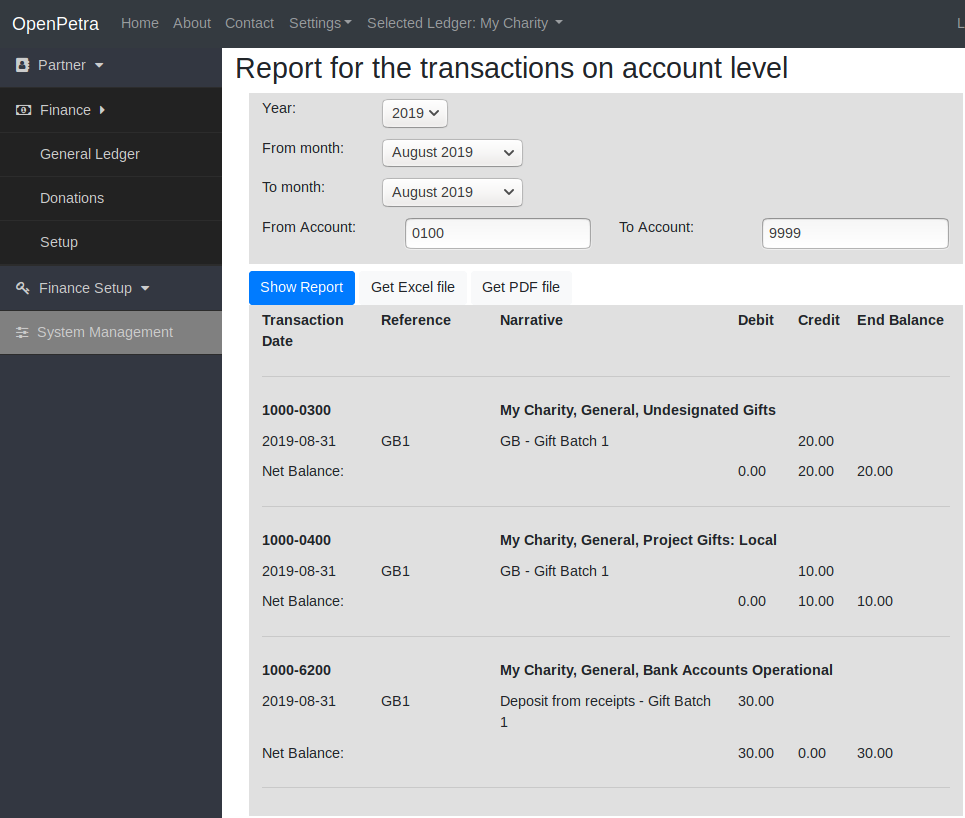

   Result of the Report

You can see the new buttons 'Get Excel File' and 'Get PDF File', which allow to export the result.

The column which is labelled 'Balance' represents the current balance at the end of the reporting period of the cost centre.

At the bottom you can see account 6200 which is our bank account, and there is one transaction per donation batch.

If there were donations posted towards multiple cost centres, you would see them here as well.
In our example, all motivations were towards the same cost centre 1000.

As mentioned before, this area still needs some work, and we are open to suggestions and pull requests!

Print Annual Donation Receipts
==============================

TODO: the documentation for the annual donation receipts is still to be written!
