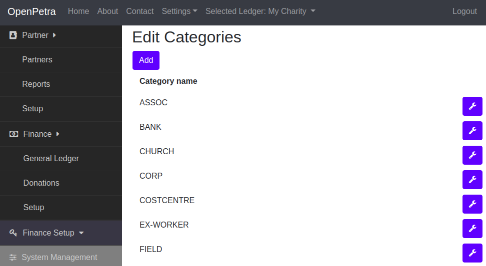
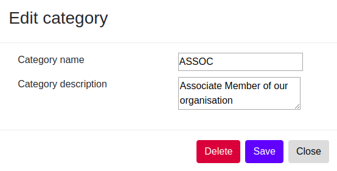
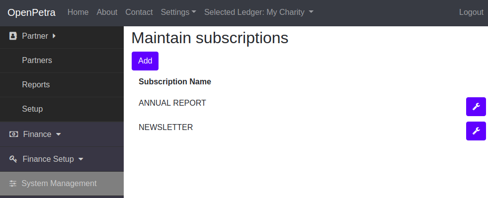
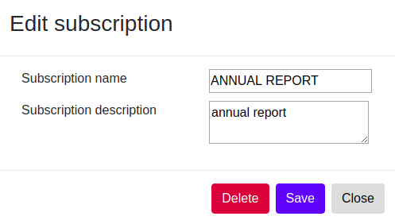

===================================
Configuration of the contact module
===================================

.. NOTE::

    Work in progress: This page is not finished yet...

Maintain Categories
===================

Categories are like special types that you can assign to your contacts and put them into groups.

For example you can have a category called SPONSOR, which you assign to all your contacts that are sponsoring a child or project.

Or you have a category for BOARDMEMBER, or WORKER.

In the sidebar menu go to *Contact*, select *Setup*, and then select *Configuration of Categories*.

.. _figure-category_list:

   Edit categories

You can delete a category, or add new categories.

The dialog looks like this:

.. _figure-category_edit:

   Edit category

Maintain Subscriptions
======================

You can specify, which recurring publications each of your contacts wants to receive.

You need to configure the type or name of such a publication.

It can be an annual report, or a recurring newsletter.

In the sidebar menu go to *Contact*, and select *Setup*, and then select *Configuration of Subscriptions*.

.. _figure-publication_list:

   Maintain Subscriptions

You can delete a subscription or add a new subscription.

The dialog looks like this:

.. _figure-publication_edit:

   Edit subscription

Import your existing addresses
==============================

You already have a list of addresses that you would like to import?

Prepare the import file
-----------------------

In order for this to work, you must rearrange the addresses in Excel or LibreOffice Calc into a format as illustrated here:

::

  "Title";"FirstName";"FamilyName";"Street";"PostCode";"City";"Country";"Email";"Mobile";"Phone"
  Herr;Arthur;Müller;"Wiesenstr. 8";"12345";"München";"DE";"mueller@gibts.net";0151-0000000000;01234-123123
  Herr und Frau;"Hans-Walter und Martina";"Meier";"Bäckerweg 3";"98765";"Frankfurt am Main";"DE";"meier@gibtsauch.net";;;

We support the import of Excel files and LibreOffice Calc files.
For legacy reasons, we still offer a CSV text import, but we currently only support the semicolon (;) as separator.

You can find a simple LibreOffice Calc sample file here: https://github.com/openpetra/openpetra/raw/test/demodata/partners/samplePartnerImport.ods

You can find a simple Excel sample file here: https://github.com/openpetra/openpetra/raw/test/demodata/partners/samplePartnerImport.xlsx

The order of the columns can be random, but the caption of the column is important.

We currently support the following columns with these captions:

* Title
* FirstName
* FamilyName
* Street
* PostCode
* City
* Country: Please note that the country code must be a 2 digit code according to ISO 3166: see https://en.wikipedia.org/wiki/List_of_ISO_3166_country_codes
* Email
* Mobile: this is the mobile phone number
* Phone: this is the landline phone number
* IBAN, IBAN1, IBAN2, IBAN3, IBAN4: bank account IBAN numbers
* TODO: Consent
* TODO: Categories

Import contacts
---------------

Now go in the side bar menu and click on *Contact*, then select *Contact*, and select *Import contacts*.

Then click one of the buttons with the label *Import contacts from LibreOffice Calc file (*.ods)* or *Import contacts from MS Excel file (*.xlsx)*.

You will get a dialog where you have to select the file that you just saved.

After a successful import you can see the list of your contacts at *Contact* / *Contact* / *Maintain Contacts*.
