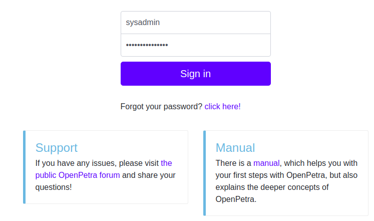
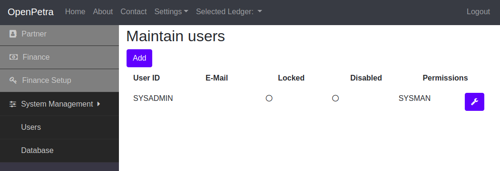
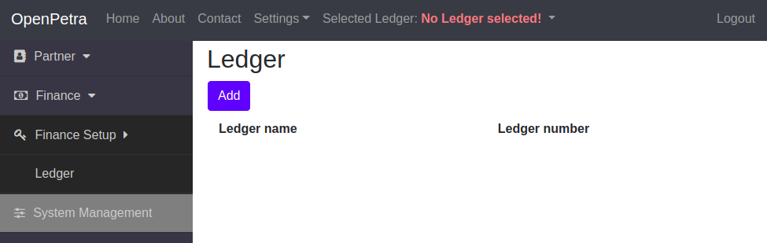
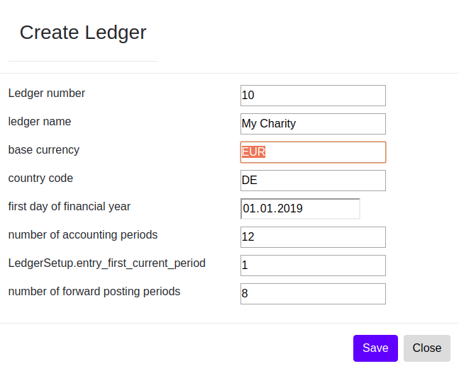
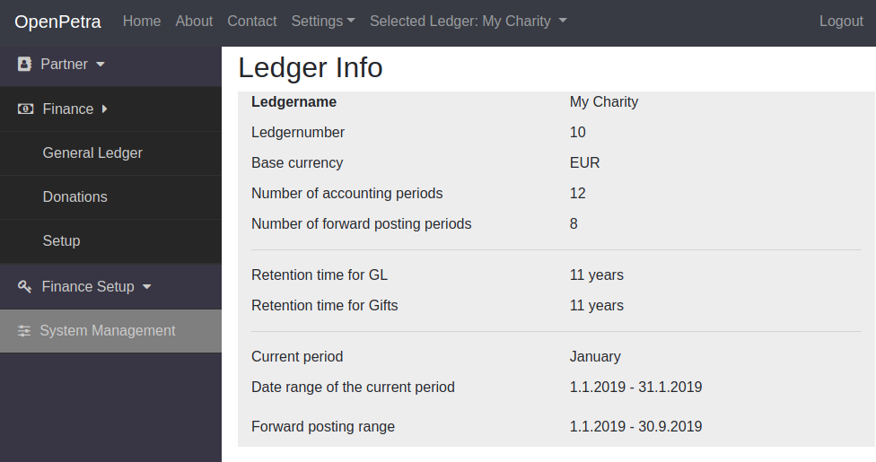

.. _initial-instance-setup:

==============================================
Configuration of a fresh instance of OpenPetra
==============================================

.. NOTE::

    Work in progress: This page is not finished yet...

We assume in these instructions that a service provider gave you access to an instance of OpenPetra.
This means you got an **URL**, eg. https://op012345.openpetra.com, and you received an e-mail with a link to set the **password** for the user ``SYSADMIN`` for the first time.

If you are working with a self-hosted OpenPetra, the default password for the user ``SYSADMIN`` is the word ``CHANGEME``, and please make sure you type all those characters of the password in capital letters.

Setting the password
====================

Once you received that e-mail, you visit the link that is written in the e-mail.

There you have to enter the new password twice, and you can choose the password yourself.

Login
=====

So you go in your web browser to the page of your OpenPetra instance, and you sign yourself in with the user ``SYSADMIN`` and the password that you just configured:

.. _figure-login_sysadmin:

   Sign in with user ``SYSADMIN``

.. _create_nonadmin_user:

Create a non-administrative user
================================

We don't recommend to do the regular tasks with the user ``SYSADMIN``. For this reason the user ``SYSADMIN`` does not have permissions in eg. the partner or finance module.

You should rather create a new user, that has permissions for the partner and the finance module, but has no permissions to create more users.
Of course you can create more users for other members of your team.

For this, you go in the sidebar menu to *System Management*, and select *Users*.

.. _figure-add_user:

   Add a user

Here you click the button *Add* to create a new user.

You will see this dialog:

.. _figure-add_user2:

.. figure:: images/add_user.png
   :scale: 50%

   Create a new user

Here you enter the user name, the E-Mail address, the firstname and the surname of the user, and specify the permissions.

Per default the modules *Finance - Basic User*, *Finance - Reporting User*, *Partner User Level Access* are already selected. For the bookkeeper in your team you should also select *Finance - Intermediate User* and *Finance - Advanced User*.

An E-Mail will be sent to the new user to inform this person about the access to OpenPetra and with a link to set the password for that user.

.. _create-a-ledger:

Create a ledger
===============

Now you sign in to OpenPetra with the user that you just created. You want to create a ledger.

Go in the sidebar menu to *Finance Setup*, and select *Ledger*.

The list of ledgers will be empty:

.. _figure-ledger_list:

   List of ledgers

You must create a ledger for each charity, usually this means you only need one ledger.

Click the button *Add* to create a new ledger.

You will see this dialog:

.. _figure-add_ledger:

   Create a new ledger

After creating the ledger you should logout with your user, and sign in again, to get permissions for the new ledger (see also `Issue 291 <https://github.com/openpetra/openpetra/issues/291>`_).

You can see the current status information about the new ledger like this: In the sidebar menu go to *Finance*, and select *General Ledger*, and below the caption *Info* you select *Ledger infos*.

Then you will see something like this:

.. _figure-ledger_info:

   Info about the ledger

