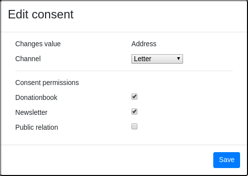
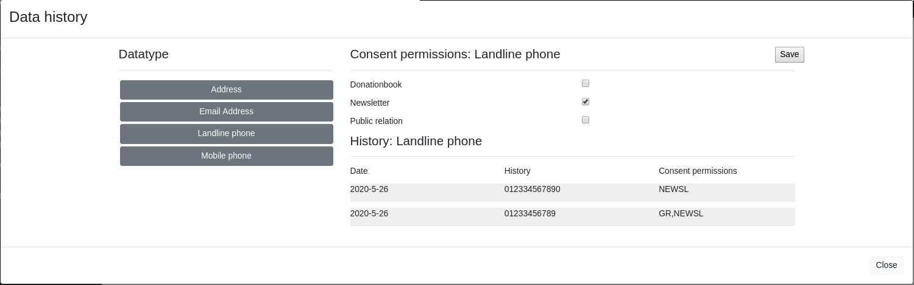

===============================
Partner edit
===============================

When you edit a partner, you might have to enter over what source this change has been noticed and what consents are allowed for these informations.

This happens whenever you change a value that, according to the GDPR, needs a purpose to be processed. 

You also have the option of displaying the history for a partner and tracking individual data, by clicking the button in the upper right corner if the partner edit window.
Here you can also adjust the purpose without having to enter new data, keep in mind that this action is also logged.

